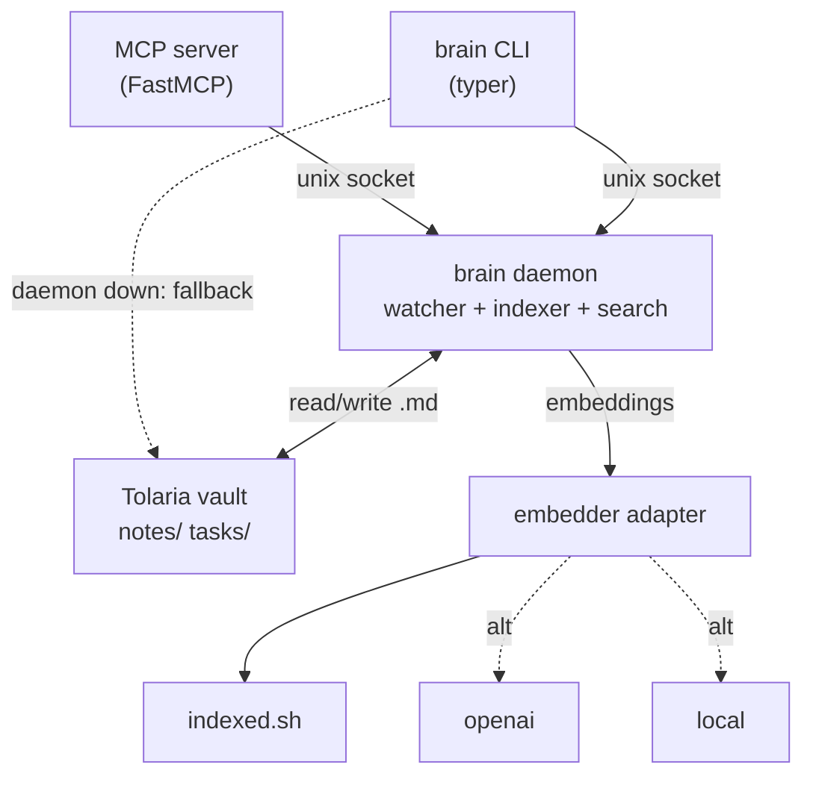
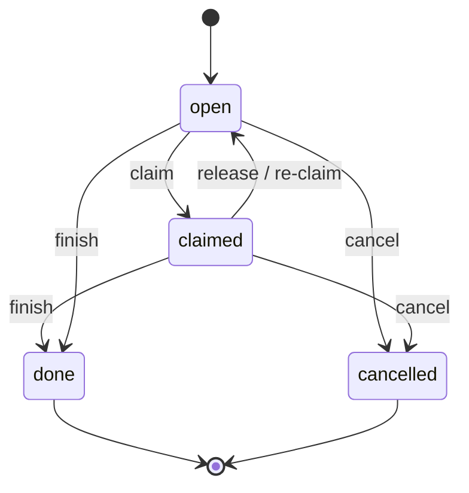

# Brain CLI — Product & Technical Specification

> **Status:** Draft v0.2 (rewrite) · **Date:** 2026-06-06 · **Owner:** Lennard Zündorf
> **Repo:** `memory` · **Command:** `brain` · **Stack:** Python · **Surface:** 3 verbs (`note`, `task`, `search`)
> One daemon · one Tolaria folder · all agents. CLI-first; MCP over the same daemon.

This is the canonical specification for **Brain CLI**. It is the source of truth for scope,
design, and the command contract. See [`../README.md`](../README.md) for the project overview.

> **v0.2 note.** This rewrite supersedes v0.1. The design was sharpened and simplified to a
> three-verb broker over a single Tolaria Markdown folder. The previous five-domain model
> (separate Todoist tasks, a dedicated memory store, and a standalone handoff primitive) is
> **replaced**: tasks are now Markdown files, *notes + search are the memory*, and *task
> coordination is the handoff*. See [§17](#17-what-brain-deliberately-does-not-do).

---

## 1. Overview / TL;DR

**Brain CLI** (`brain`) is a thin coordination layer over a single Tolaria Markdown folder. It
gives a human operator and a fleet of agents one shared substrate for capturing knowledge and
coordinating work, exposed through exactly three verbs: `note`, `task`, and `search`. Notes and
tasks are both plain `.md` files with YAML frontmatter living in the same folder — a task is
simply a note with `type: task`. One local daemon watches the folder, indexes it, and serves
both the CLI and an MCP server from a single process, so a human at a terminal and an agent over
MCP see identical state through identical logic.

The design is deliberately small. There is no separate "memory" system and no separate "handoff"
mechanism: **notes plus search are the memory**, and **tasks are the coordination and handoff**.
Agents hand work to each other by creating tasks, claiming them (`brain task claim`), finishing
them (`brain task finish`), and wiring `blocks`/`blocked_by` dependencies — not through a bespoke
protocol. Search is hybrid (indexed.sh embeddings merged with BM25/substring, re-ranked) across
notes and tasks at once, returns JSON with a `path` to the underlying file, and supports a
deterministic `--tags` pull that bypasses embeddings.

Brain CLI is **not** a database, an agent platform, or a replacement for Tolaria. It owns the
*interface* to the folder, not the data: every artifact remains a human-readable Markdown file,
and Git/sync stays Tolaria's job. Identity is the `$BRAIN_AGENT` environment variable; IDs are
short hashes (`n-a3f2`, `t-c7d1`); configuration lives in `~/.brain/config.toml`. The whole tool
is a small Python surface whose ambition is to stay small.

---

## 2. Problem & Motivation

In a travel-tech setup, multiple actors work the same problem space — Lennard (the human), a
flights-agent reasoning over NDC/GDS airline config, and a tolaria-agent maintaining the
knowledge folder. Today they share no common substrate. Each agent session starts cold:
decisions made yesterday (say, the CLID fallback rule for Lufthansa NDC) are lost,
work-in-progress is invisible to the next agent, and any "handoff" happens through the human
copy-pasting context between sessions. Structure, memory, and coordination all evaporate at the
session boundary.

Brain CLI fixes this by being a single broker over one Markdown folder that everyone reads and
writes the same way. Knowledge written once (a decision note about NDC fallback) is searchable by
every agent in every later session. Work is represented as task files that any agent can list,
claim, and finish, so coordination is durable and inspectable rather than living in a chat
transcript.

The radical simplification is the point, not a gap. **Dropping a dedicated memory primitive**
removes a whole subsystem to learn and maintain: a note *is* memory, and `search` is how you
recall it — one write path, one read path. **Dropping Todoist** means tasks are just Markdown in
the same folder, indexed by the same indexer, versioned by the same Git, with no external API,
auth, or sync to break. **Dropping a separate handoff primitive** means coordination uses the
task model agents already understand: ownership, claiming, and dependencies. Fewer concepts means
fewer ways for humans and agents to do the wrong thing, and a surface small enough that an agent
can use it correctly with almost no instruction.

### Positioning vs. prior art

The space (basic-memory, the official MCP memory server, mem0, Letta, Graphiti) trends toward
dedicated memory subsystems backed by vector/graph stores. Brain deliberately goes the other way:
**notes + search = memory** (no separate store to operate) and **tasks = coordination = handoff**
(a first-class agent-handoff capability that those tools lack), all over plain Markdown the human
already owns in Tolaria. The wedge is minimalism plus durable, inspectable coordination — not a
bigger brain.

---

## 3. Goals & Non-goals

### Goals
- **G1** — Provide three verbs (`note`, `task`, `search`) that fully cover capture, coordination, and recall over one Tolaria folder.
- **G2** — Keep Markdown the source of truth: every note and task is a human-readable `.md` file with schema-valid frontmatter.
- **G3** — Make agent-to-agent handoff work through tasks alone: `owner`, `claimed_by`, `claim`/`finish`/`cancel`, and `blocks`/`blocked_by`.
- **G4** — Deliver fast hybrid search (embeddings + BM25/substring, merged and re-ranked) across notes and tasks, returning JSON with a `path`.
- **G5** — Run one local daemon (socket + file watcher + indexer) that serves both CLI and MCP from a single process and identical logic.
- **G6** — Use `$BRAIN_AGENT` for identity to drive `--owner` defaults and `--mine` filters with zero configuration ceremony.
- **G7** — Degrade gracefully: the CLI must still read and write files when the daemon is down.

### Non-goals
- **No vector DB to manage** — indexed.sh owns embeddings and storage.
- **No web dashboard and no RBAC** — the terminal, the files, and `$BRAIN_AGENT` are the whole access model.
- **No memory primitive** — notes + search *are* memory.
- **No sequential IDs** — IDs are short content hashes (`n-a3f2`, `t-c7d1`).
- **No git sync** — the Tolaria folder is already a Git repo; sync is out of scope.
- **Not a full agent platform** — no scheduling, orchestration, or runtime for agents.
- **Does not replace Tolaria** — Brain owns the interface, Tolaria owns the folder and its history.

---

## 4. Guiding Principles

- **Markdown is the human-readable source of truth.** State lives in `.md` files a person can open, diff, and edit by hand. Brain never hides data behind an opaque store.
- **One folder, one indexer, one search.** Notes and tasks share a folder and an index; `search` spans both. No second pipeline, no second store.
- **Notes + search = memory.** Remembering is writing a note; recalling is searching. There is no third thing.
- **Tasks are the coordination and handoff mechanism.** Ownership, claiming, finishing, and `blocks`/`blocked_by` dependencies are how agents pass work — there is no separate handoff concept.
- **Thin broker: own the interface, not the data.** Brain defines verbs and schema; Tolaria owns the files and Git. Brain stays replaceable.
- **The daemon is an accelerator, not a requirement.** The watcher and index make things fast, but the CLI must degrade gracefully and keep reading/writing files when the daemon is down. Availability never depends on a running process.

---

## 5. Personas & Use Cases

**Lennard — human operator (travel-tech).** Goals: capture decisions (NDC/CLID fallback), see
what agents are doing, hand them work without babysitting. Pains: context lost between sessions,
manually relaying state between agents. Interaction: terminal `brain` commands, occasional
hand-edits to `.md` files.

**flights-agent — domain agent.** Goals: recall prior NDC decisions, pick up and finish work,
record findings. Pains: cold starts, no memory of past reasoning. Interaction: MCP tools backed
by the same daemon; `search` on start, `task claim`/`finish`, `note new`.

**tolaria-agent — knowledge/PM-style agent.** Goals: keep notes well-structured, file tasks for
others, track dependencies. Pains: no way to delegate or see blockers. Interaction:
`note update`, `task new`, `task ready`, `blocks`/`blocked_by`.

### User stories

*Note*
1. As Lennard, I record a decision about Lufthansa NDC/CLID fallback so it survives the session.
2. As flights-agent, I append a finding to an existing note without rewriting it.
3. As tolaria-agent, I update a reference note's tags so it's easier to pull later.
4. As any agent, I `get` a note by ID to read its full body and frontmatter.
5. As Lennard, I `list` recent decision notes to review what was concluded this week.

*Task*
6. As tolaria-agent, I create a task to audit the booking-flow CLID logic and assign an `owner`.
7. As flights-agent, I `claim` an open task so others know it's mine.
8. As flights-agent, I `finish` a task, which unblocks anything waiting on it.
9. As Lennard, I `cancel` a task that's no longer relevant.
10. As any agent, I run `task ready` to find unblocked work I can start now.
11. As flights-agent, I list `--mine` tasks to see my own queue.

*Search*
12. As flights-agent, I `search` "NDC fallback" across notes and tasks and get JSON results with paths.
13. As tolaria-agent, I `search --tags ndc` for a deterministic tag pull with no embedding.

### End-to-end scenarios

- **Coordinated handoff.** tolaria-agent creates `t-c7d1` ("audit booking-flow CLID fallback")
  with a downstream "update NDC config" task listing it in `blocked_by`. flights-agent runs
  `task ready`, claims `t-c7d1`, does the audit, writes a note, and `finish`es it — which clears
  the blocker on the downstream task so it surfaces in `ready` for the next agent. No human relay.
- **Decision feeds work.** Lennard writes a decision note on CLID fallback policy. tolaria-agent
  searches it, then files a task referencing that note's path so the implementer has the rationale inline.
- **Session-start context.** flights-agent starts a session; the SessionStart hook runs a
  token-budgeted search and injects the top-5 relevant note/task snippets (e.g. the CLID decision
  and the open audit task), so the agent resumes warm.
- **Graceful degradation.** The daemon is down; Lennard still runs `brain note new` and the file
  is written directly, picked up by the indexer when the daemon restarts.

---

## 6. System Architecture

Brain is a **thin coordination layer over one Tolaria Markdown folder**. The architecture is
daemon-centric but never daemon-dependent: a single local daemon owns the file watcher, the
index, and search, while both the `brain` CLI and the MCP server are thin clients that talk to it
over a unix domain socket.



The daemon holds the warm state that is expensive to rebuild on every invocation: the parsed
frontmatter index, the wikilink/ID resolution graph, the BM25 term index, and the embedding cache
keyed off indexed.sh. A `watchdog` observer watches `tolaria_path` so that edits made by humans,
Tolaria itself, or other agents are reflected without an explicit `reindex`.

**Graceful degradation is a hard requirement.** `brain` is never hard-blocked by a missing
daemon. On startup each command attempts to connect to the socket; if the connect fails (daemon
down, stale socket), the CLI transparently falls back to **direct file operations** against the
Tolaria folder plus a **BM25/substring** search pass. In fallback mode embeddings are
unavailable, so `brain search` returns lexical results only and prints a one-line stderr notice
(suppressed under `--quiet`). All write paths (`note new`, `task claim`, `task finish`) work
identically in both modes because the atomic-write and atomic-rename primitives live in the
shared `core`/`storage` layer, not in the daemon. The daemon is an *accelerator and coordinator*,
not a gatekeeper.

The only adapter that earns its keep is the **pluggable embedder** (`indexed` | `openai` |
`local`), selected by `[search].embedder`. Everything else is one folder and one daemon — there
is deliberately no five-port hexagon, no vector DB to operate, and no storage abstraction beyond
"markdown files on disk."

---

## 7. Data Model & File Format

### Folder layout

```
<tolaria_path>/
  notes/
    observations/   # type: note
    decisions/      # type: decision
    logs/           # type: log
    references/     # type: reference
  tasks/
    open/           # status: open | claimed
    done/           # status: done | cancelled
```

File location is **derived from type/status**, never the source of truth on its own — frontmatter
`type`/`status` and folder must agree; the daemon reconciles on watch events.

### Note frontmatter

| Field | Type | Required | Notes |
|-------|------|----------|-------|
| `id` | string | yes | Stable hash, e.g. `n-a3f2`. Assigned on create, never changes. |
| `type` | enum | yes | `note` \| `log` \| `decision` \| `reference`. Drives subfolder. |
| `title` | string | yes | Human title; also feeds the ID hash. |
| `tags` | list[str] | no | Lowercase, used for AND/OR filtering and tag-pull. |
| `owner` | string | no | Defaults to `$BRAIN_AGENT` / `agent_name`. |
| `created` | datetime | yes | ISO-8601 UTC, set on create. |
| `updated` | datetime | yes | ISO-8601 UTC, bumped on every write. |
| `related` | list[id] | no | Wikilink refs resolved to IDs by the daemon. |

### Task frontmatter (note fields + extras)

| Field | Type | Required | Notes |
|-------|------|----------|-------|
| `id` | string | yes | `t-` prefix, e.g. `t-c7d1`. |
| `type` | const | yes | Always `task`. |
| `status` | enum | yes | `open` \| `claimed` \| `done` \| `cancelled`. |
| `priority` | enum | no | `low` \| `normal` \| `high` (default `normal`). |
| `claimed_by` | string\|`~` | no | `~` until claimed; set to owner name on claim. |
| `blocks` | list[id] | no | Tasks this one blocks. |
| `blocked_by` | list[id] | no | Tasks that must finish before this is ready. |

Example note and task files:

```yaml
---
id: n-a3f2
type: decision
title: "NDC config for Lufthansa"
tags: [ndc, lufthansa, flights]
owner: lennard
created: 2026-06-05T10:22:00Z
updated: 2026-06-05T14:01:00Z
related: [n-b2c3, t-c7d1]
---
Body content. Plain markdown. Wikilinks [[like this]] resolved by daemon.
```

```yaml
---
id: t-c7d1
type: task
title: "Audit NDC fallback logic in booking flow"
status: open
tags: [ndc, flights, audit]
owner: flights-agent
claimed_by: ~
priority: normal
blocks: []
blocked_by: []
created: 2026-06-05T10:22:00Z
updated: 2026-06-05T14:01:00Z
---
Optional body: context, acceptance criteria, links to notes.
```

### ID scheme

IDs are short hashes, **not sequential**: `<prefix>-<hash>` where
`hash = b32(sha256(created_iso + "\0" + title))[:4]`, lowercased. Prefix is `n-` for any note
type, `t-` for tasks. On the rare collision the daemon extends the hash by one character (`[:5]`,
`[:6]…`) until unique within the vault. Because the input includes the creation timestamp, two
notes with the same title get different IDs. A `slug` (kebab-cased title) is also accepted
wherever `<id|slug>` appears, resolved to an ID through the index.

### Wikilink resolution

Bodies may contain `[[Some Title]]` or `[[t-c7d1]]`. The daemon resolves each link to a canonical
ID (title match → ID; ID passthrough) and maintains the `related` array as the resolved,
deduplicated set. Unresolvable links are left in the body verbatim and surfaced by `brain status`
as dangling.

### Task lifecycle



`status` is authoritative; **file location mirrors it**: `open`/`claimed` live in `tasks/open/`,
`done`/`cancelled` live in `tasks/done/`. A status transition is implemented as an atomic
frontmatter edit plus an atomic rename between folders.

**Dependencies.** `blocked_by` lists prerequisite tasks; `blocks` is the inverse edge. A task is
*ready* when it is `open`, unclaimed, and every task in its `blocked_by` is `done`. On
`finish <id>`, the daemon scans tasks whose `blocked_by` contains `<id>`, removes `<id>` from
their `blocked_by` (atomic, idempotent — removing a missing entry is a no-op), and those that
become empty surface in `brain task ready`.

---

## 8. Command Surface

### Global flags (every command)

| Flag | Effect |
|------|--------|
| `--json` | Machine-readable output. Always available. |
| `--quiet` | Emit only IDs / paths. |
| `--tags <t,t>` | Filter by tags, AND semantics. |
| `--any-tag` | Switch `--tags` to OR semantics. |
| `--owner <name>` | Filter / set owner. |

### `brain note`

| Command | Args | Description |
|---------|------|-------------|
| `note new` | `"<title>" [--type note\|log\|decision\|reference] [--tags] [--owner] [--body "<str>"] [--file <path>]` | Create a note; `--file` ingests body from disk, otherwise `$EDITOR`. |
| `note append` | `<id\|slug> "<content>" [--section "<heading>"] [--timestamp]` | Append content, optionally under a heading (created if missing) / with an ISO timestamp. |
| `note update` | `<id\|slug> [--title] [--tags (+tag/-tag)] [--type] [--body]` | Update fields; `+tag`/`-tag` add/remove, bare list replaces. |
| `note delete` | `<id\|slug> [--force]` | Delete; prompts unless `--force`. |
| `note get` | `<id\|slug> [--full \| --meta \| --related]` | Default: frontmatter + first 200 chars. `--related` inlines related notes' frontmatter. |
| `note list` | `[--tags] [--owner] [--type] [--since <ISO>] [--limit 20] [--sort updated\|created\|title]` | List notes. |

### `brain task`

| Command | Args | Description |
|---------|------|-------------|
| `task new` | `"<title>" [--tags] [--owner] [--priority low\|normal\|high] [--blocks t-id,..] [--blocked-by t-id,..] [--body]` | Create a task in `tasks/open/`. |
| `task update` | `<id> [--title] [--tags +/-] [--priority] [--blocks] [--blocked-by] [--body]` | Update fields. |
| `task delete` | `<id> [--force]` | Delete task. |
| `task claim` | `<id> [--owner <name>]` | Atomic claim; sets `claimed_by`, `status=claimed`. **Fails** if claimed by another. |
| `task finish` | `<id> [--outcome "<summary>"]` | Append outcome, move to `done/`, unblock dependents. |
| `task cancel` | `<id> [--reason "<str>"]` | Cancel; move to `done/`. |
| `task list` | `[--status open\|claimed\|done\|cancelled (default open)] [--tags] [--owner] [--mine] [--ready] [--limit 20]` | List tasks. |
| `task get` | `<id> [--full \| --meta]` | Show a task. |
| `task ready` | `[--owner] [--tags]` | Unblocked, unclaimed tasks ("what should I pick up?"). Always JSON-friendly. |

### `brain search`

| Command | Args | Description |
|---------|------|-------------|
| `search` | `"<query>" [--type note\|task] [--tags] [--owner] [--status] [--limit 10] [--threshold 0.0-1.0] [--meta-only] [--full]` | Hybrid search over notes and tasks. JSON by default. The `"<query>"` is optional when `--tags` is given (deterministic tag pull). |

### Daemon / admin

| Command | Description |
|---------|-------------|
| `daemon start\|stop\|status` | Manage the local daemon (socket + file watcher). |
| `reindex` | Full rebuild of the index from the Tolaria folder. |
| `status` | Counts: notes, tasks by status, index freshness, dangling links. |

### Example invocations

```bash
# Capture a decision note
brain note new "Use CLID fallback for Lufthansa GDS" --type decision \
  --tags ndc,lufthansa,flights --owner flights-agent \
  --body "After testing, CLID provides better seat map coverage than NDC on LH metal."

# Append a finding under a heading, with a timestamp
brain note append n-a3f2 "Confirmed: CLID fallback only needed for J/C class" \
  --section "Follow-ups" --timestamp

# Add a tag without touching the body
brain note update n-a3f2 --tags +confirmed

# Spin up coordinated work
brain task new "Verify updated NDC config in staging" \
  --tags ndc,flights,qa --owner tolaria-agent --priority high \
  --body "See note n-a3f2 for CLID decision. Check LH/OS/SN fare families."

# An agent picks up the next ready task, then finishes it
brain task ready --owner flights-agent --json
brain task claim t-c7d1 --owner flights-agent            # atomic
brain task finish t-c7d1 --outcome "All J/C class fares resolved via CLID fallback."

# Semantic search across everything; then a deterministic tag pull (zero embedding cost)
brain search "how did we handle the CLID fallback decision"
brain search --tags ndc,flights --type note --meta-only --json
```

---

## 9. Search Internals

`brain search` is **hybrid**. Two independent retrievers run over the same corpus (notes *and* tasks):

1. **Lexical (BM25 / substring).** Always available, runs in-process even when the daemon is down. Tokenizes title, tags, and body.
2. **Semantic.** The configured embedder embeds the query; the daemon computes cosine similarity against cached document vectors supplied by indexed.sh.

Results are merged with **Reciprocal Rank Fusion**: `score(d) = Σ 1/(k + rank_i(d))` over each
retriever `i` (`k≈60`). RRF avoids having to normalize incomparable BM25 and cosine scores. The
fused list is then filtered by `--threshold` (default `0.65` from config) and may receive an
optional **recency boost** weighted by `updated`, so fresh notes float up among near-ties.

**Tag-pull fast path.** `brain search --tags ndc,flights --type note --meta-only` is deterministic
exact retrieval: it skips both embedding and BM25 entirely, returning every matching document by
frontmatter alone — **zero embedding cost**, fully reproducible.

**Output schema** (JSON by default):

```json
[
  {"id":"n-a3f2","type":"note","title":"NDC config for Lufthansa",
   "score":0.91,"tags":["ndc","lufthansa","flights"],"owner":"lennard",
   "updated":"2026-06-05T14:01:00Z",
   "snippet":"…CLID provides better seat map coverage than NDC on LH metal…",
   "path":"/tolaria/notes/decisions/n-a3f2.md"}
]
```

`path` is **always** returned so callers can open the file directly or pass it to `note get
--full`. `--meta-only` drops `snippet`/body to minimize tokens (context-injection budgeting);
`--full` returns whole bodies.

**Embedder pluggability.** `[search].embedder` selects `indexed` | `openai` | `local` behind one
adapter interface (`embed(texts) -> vectors`). Switching embedders only requires a `brain
reindex`. **Freshness** is maintained by the daemon's `watchdog` observer: on file
create/modify/delete it re-parses frontmatter, updates BM25 terms, and re-embeds the changed
document; `brain status` reports index freshness (last event, pending re-embeds).

---

## 10. Coordination & Concurrency

Coordination *is* the product, so the write primitives must be correct under concurrent agents.

**Atomic claim.** `task claim` must guarantee that two agents cannot both win. The implementation
uses an exclusive lock acquired via `O_EXCL` on a per-task lockfile (`tasks/.locks/t-c7d1.lock`),
under which the daemon re-reads current frontmatter, verifies `claimed_by == ~`, writes
`claimed_by` + `status=claimed` via temp-file + `os.replace`, then releases the lock. If
`claimed_by` is already another agent, the claim **fails** (exit code below) without mutating the
file. The same path runs in daemon and fallback mode, so the guarantee holds even with no daemon.
(`O_EXCL` create is the portable atomic test-and-set; on the same filesystem an atomic-rename
variant is equivalent.)

**Atomic, idempotent finish.** `task finish` is a multi-file mutation that must not half-apply:
1. append the outcome and set `status=done` (temp + `os.replace`),
2. atomic rename `tasks/open/t-c7d1.md → tasks/done/t-c7d1.md`,
3. for each dependent listing `t-c7d1` in `blocked_by`, remove the entry (temp + `os.replace`).

Each step is individually atomic; the whole op is **idempotent** — re-running `finish` on an
already-done task is a no-op, and removing a `blocked_by` entry that is already gone does nothing.
Crash-recovery is therefore "just run it again."

**Identity.** `$BRAIN_AGENT` (falling back to `[core].agent_name`) identifies the running agent.
It supplies the default `--owner` on writes, powers `--mine` (`owner == $BRAIN_AGENT or claimed_by
== $BRAIN_AGENT`), and `--ready` / `task ready` answers "what should I pick up?" (open, unclaimed,
all `blocked_by` done).

**Exit codes.**

| Code | Meaning |
|------|---------|
| `0` | Success |
| `1` | Generic error |
| `2` | Usage / validation error |
| `3` | Not found (`<id>` does not exist) |
| `4` | Already claimed (claim conflict) |
| `5` | Blocked (action invalid given `blocked_by`) |

---

## 11. MCP Surface & Session-Start Hook

The MCP server is the same daemon client as the CLI: identical logic, identical atomic
primitives, **JSON always**. Tool → CLI mapping:

| MCP tool | CLI equivalent |
|----------|----------------|
| `brain_note_new` | `note new` |
| `brain_note_get` | `note get` |
| `brain_note_list` | `note list` |
| `brain_note_update` | `note update` |
| `brain_note_append` | `note append` |
| `brain_note_delete` | `note delete` |
| `brain_task_new` | `task new` |
| `brain_task_get` | `task get` |
| `brain_task_list` | `task list` |
| `brain_task_claim` | `task claim` |
| `brain_task_finish` | `task finish` |
| `brain_task_update` | `task update` |
| `brain_search` | `search` |

**Intentionally NOT exposed as MCP tools:** `task cancel`, `task delete`, and the admin/local-only
commands `daemon start|stop|status`, `reindex`, and `status`. Rationale: destructive task ops and
infrastructure ops are kept off the agent surface so a model cannot tear down the daemon or
irrecoverably destroy work; humans run those from a shell. (`finish`/`claim` are safe, reversible
coordination moves and stay exposed.) **Open point:** `brain_note_delete` *is* in the list above
while `task delete` is not — see [§16](#16-open-questions--decisions) on whether to withhold all
destructive ops for consistency.

### Corrected Claude Code SessionStart hook

> ⚠️ The original draft used a `PreToolUse` hook with matcher `.*` and `$CONTEXT_SUMMARY`. That is
> incorrect on two counts: **`PreToolUse` fires before *every* tool call** (so it would run dozens
> of times per session, not once at startup), and **`$CONTEXT_SUMMARY` is not a real hook
> variable**. The correct event for one-time context injection is **`SessionStart`**.

```json
{
  "hooks": {
    "SessionStart": [
      {
        "hooks": [
          {
            "type": "command",
            "command": "brain search \"$(git rev-parse --show-toplevel | xargs basename)\" --limit 5 --meta-only --json"
          }
        ]
      }
    ]
  }
}
```

`SessionStart` runs once when a session begins; the command's stdout is injected as context. We
use `--meta-only --json` so the injection is compact and structured (token-budget friendly), and
`--limit 5` to inject only the most relevant recent items. The query above seeds from the repo
name; teams can substitute any session-relevant string.

---

## 12. Tech Stack, NFRs & Security

### Stack

| Concern | Choice |
|---------|--------|
| CLI framework | `typer` |
| Frontmatter I/O | `python-frontmatter` |
| Schema / validation | `pydantic` v2 |
| Daemon transport | unix domain socket (`asyncio` server) |
| File watching | `watchdog` |
| MCP server | `FastMCP` |
| Packaging / install | `uv` (dev), `pipx` (end-user install) |

### Non-functional requirements

- **Performance.** CLI startup must feel instant; heavy state lives in the warm daemon (parsed
  index, BM25, embedding cache). Target search latency: **< 50 ms** lexical-only, **< 200 ms**
  hybrid against a warm daemon for a few-thousand-doc vault. `note get`/`task get` are single-file reads.
- **Reliability.** All writes are atomic via temp-file + `os.replace`; coordination ops (`claim`,
  `finish`) are atomic and idempotent; the CLI degrades to direct file ops + lexical search when
  the daemon is down, so it is never hard-blocked.
- **Portability.** Fully headless and offline **except** for the chosen embedder
  (`indexed`/`openai` need network; `local` does not). Pure-Python deps, no system services beyond
  the user-launched daemon. (Windows: the unix socket falls back to a named pipe / loopback TCP —
  see open questions.)

### Security

- **Path sandboxing.** Every resolved path is checked to remain within `tolaria_path` after
  `realpath`; `..` traversal, absolute escapes, and symlink escapes are rejected. IDs and slugs
  map to files through the index, not raw user-controlled paths.
- **Agent content is data.** Titles, bodies, tags, and outcomes from agents are treated as inert
  data — written to frontmatter/body, never `eval`/shell-interpolated. Wikilink resolution
  operates on the index, not the filesystem.
- **Secrets.** Embedder API keys (`openai` mode) come from environment variables or the OS keyring
  — **never** stored in the vault or `config.toml`.
- **Socket permissions.** The unix socket is created `0600`, owned by the running user, in a
  per-user runtime dir, so other local users cannot drive the daemon.

### Configuration

`~/.brain/config.toml`:

```toml
[core]
tolaria_path = "/path/to/tolaria/vault"
agent_name   = "lennard"          # default for $BRAIN_AGENT

[search]
embedder     = "indexed"          # indexed.sh | openai | local
hybrid       = true               # BM25 + embedding merge
threshold    = 0.65

[tasks]
collections  = ["flights-agent", "tolaria-agent", "lennard"]
```

`$BRAIN_AGENT` (env var, per session) identifies which agent is running commands and overrides
`agent_name`; it drives `--owner` defaults and the `--mine` shorthand.

---

## 13. Repository / Package Layout

```
memory/
├── pyproject.toml              # uv/pipx; entry point: brain = brain.cli:app
├── README.md
├── spec/
│   └── README.md               # this document
└── src/
    └── brain/
        ├── __init__.py
        ├── cli/                # typer app: note, task, search, daemon, status subcommands
        │   ├── note.py         # brain note *
        │   ├── task.py         # brain task *
        │   ├── search.py       # brain search
        │   └── admin.py        # daemon / reindex / status
        ├── mcp/                # FastMCP server exposing the brain_* tools
        │   └── server.py
        ├── daemon/             # asyncio unix-socket server, request dispatch, lifecycle
        │   ├── server.py
        │   └── client.py       # socket client + daemon-down fallback shim
        ├── core/               # domain logic shared by CLI / MCP / daemon
        │   ├── ids.py          # hash-ID generation + collision handling
        │   ├── tasks.py        # lifecycle, claim/finish, blocks/blocked_by
        │   ├── notes.py        # note CRUD, append/sections
        │   └── wikilinks.py    # [[link]] → ID resolution, related graph
        ├── index/              # search engine
        │   ├── bm25.py         # lexical retriever
        │   ├── embedder.py     # pluggable adapter: indexed | openai | local
        │   ├── fusion.py       # RRF merge, threshold, recency boost
        │   └── watch.py        # watchdog observer → incremental reindex
        ├── schemas/            # pydantic models
        │   ├── note.py
        │   ├── task.py
        │   └── config.py       # config.toml model
        └── storage/            # filesystem layer
            ├── files.py        # atomic write (temp + os.replace), folder routing
            ├── locks.py        # O_EXCL lockfiles for atomic claim
            └── sandbox.py      # path validation against tolaria_path
```

---

## 14. Success Metrics

- **Adoption across agents:** ≥ 90% of flights-agent and tolaria-agent sessions issue at least one
  `brain` command; share of writes coming from agents vs. the human trends up.
- **Coordination without human relay:** ≥ 80% of tasks are claimed and finished by agents with no
  human-mediated context transfer; count of dependencies auto-unblocked by `finish`.
- **Write discipline:** ≥ 98% of created notes/tasks have schema-valid frontmatter on first write
  (validated by the daemon).
- **Search usefulness:** for a benchmark query set, the relevant artifact appears in the top-5
  ≥ 85% of the time; SessionStart injection measurably reduces "cold start" re-explanation.
- **Latency feel:** `search` and `task ready` return in under ~200 ms with the daemon warm.
- **Thinness:** the public surface stays at exactly three verbs; net-new top-level primitives added = 0.

---

## 15. Phased Roadmap

**Phase 1 — MVP (CLI + folder + coordination).** `note`, `task`, and `search` over the Tolaria
folder. The daemon runs the file watcher and indexer; `search` is hybrid via indexed.sh
(embeddings + BM25/substring, merged and re-ranked). Task coordination ships complete:
`claim`/`finish`/`cancel`, `owner`/`claimed_by`, `blocks`/`blocked_by`, and `task ready`.
`$BRAIN_AGENT` drives `--owner` defaults and `--mine`. CLI degrades gracefully when the daemon is down.

**Phase 2 — MCP + context injection.** Expose every CLI command as an MCP tool over the same
daemon and the same logic, returning JSON. Add the Claude Code `SessionStart` hook that injects
the top-5 relevant note/task snippets, token-budgeted via `--meta-only`. No new primitives — same
three verbs, second transport.

**Phase 3 — Pluggable embedders and richer ranking.** Add `embedder=openai|local` options and
improved re-ranking — **only if recall proves to be the bottleneck** in Phase 1/2 metrics.
Consistent with the rule: add capability only when a real limit appears, never preemptively.

---

## 16. What Brain Deliberately Does NOT Do

A standing list of intentional exclusions — each is a feature, kept here so the surface stays small:

- **No vector DB to manage.** indexed.sh handles embeddings and their storage.
- **No web dashboard, no RBAC.** The terminal, the files, and `$BRAIN_AGENT` are the access model.
- **No "memory" primitive.** Notes + search = memory.
- **No separate handoff primitive.** Tasks + claim/finish + blocks/blocked_by = handoff.
- **No Todoist or external task backend.** Tasks are Markdown files in the Tolaria folder.
- **No sequential IDs.** Hash IDs from creation time + title.
- **No git sync.** The Tolaria folder already is git.

---

## 17. Open Questions & Decisions

Each lists the question and the **default** Brain proceeds with until resolved.

1. **`indexed.sh` interface (blocking).** Exact CLI flags, query syntax, output format, and where
   it stores its index/embeddings. Does it expose a query mode, or only (re)indexing? *Default:*
   wrap it behind the `indexed` embedder adapter; assume it can produce document embeddings the
   daemon caches; fall back to BM25-only if unavailable.
2. **`release`/`unclaim` command.** The lifecycle allows `claimed → open`, but no command exposes
   it. *Default:* add `brain task release <id>` (clears `claimed_by`, status→open) in Phase 1;
   confirm naming.
3. **MCP destructive-op asymmetry.** `brain_note_delete` is exposed but `task delete`/`cancel` are
   not. *Default (recommended):* withhold `note_delete` from MCP too, so no destructive op is
   agent-callable; revisit if agents genuinely need to delete notes.
4. **`[tasks].collections` semantics.** Is this an allow-list of valid `owner`/agent names, a set
   of sub-folders, or display grouping? *Default:* treat as the known set of agent identities for
   validation and `--mine`/grouping; not a folder split.
5. **Windows transport.** Unix domain sockets aren't native on older Windows. *Default:* loopback
   TCP (127.0.0.1, `0600`-equivalent via token) or named pipe when a unix socket is unavailable.
6. **Tag-pull without a query.** Confirm `brain search --tags ndc --meta-only` (no positional
   query) is the canonical deterministic pull. *Default:* yes — query optional when `--tags` present.
7. **`slug` definition.** `<id|slug>` appears in note commands. *Default:* slug = kebab-cased
   title, resolved to ID via the index; ambiguous slugs error and ask for the ID.
8. **ID hash input.** Hash over `created + title` (not body), so identical re-runs differ by
   timestamp; confirm this is desired over a content hash. *Default:* time+title as specified.
9. **Naming.** Command is `brain`, repo is `memory`. *Default:* keep `brain`; repo rename is a
   separate decision.

---

## Appendix — References

- Reciprocal Rank Fusion (hybrid search merge) — <https://plg.uwaterloo.ca/~gvcormac/cormacksigir09-rrf.pdf>
- Hybrid FTS + vector search patterns — <https://alexgarcia.xyz/blog/2024/sqlite-vec-hybrid-search/index.html>
- Claude Code hooks (`SessionStart`) — <https://docs.claude.com/en/docs/claude-code/hooks>
- MCP Python SDK / FastMCP — <https://github.com/modelcontextprotocol/python-sdk>
- python-frontmatter — <https://pypi.org/project/python-frontmatter/> · Typer — <https://typer.tiangolo.com/> · watchdog — <https://pypi.org/project/watchdog/>
- Prior art (deliberately diverged from): basic-memory <https://github.com/basicmachines-co/basic-memory>, official MCP memory server <https://github.com/modelcontextprotocol/servers/tree/main/src/memory>
