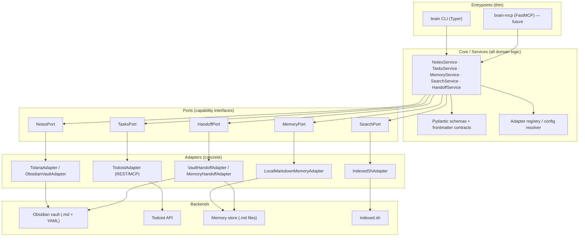

# Brain CLI — Product Requirements & Specification

> **Status:** Draft v0.1 · **Date:** 2026-06-04 · **Owner:** Lennard Zündorf
> **Repo:** `memory` · **Command:** `brain` · **Package:** `brain-cli` · **Future MCP mode:** `brain-mcp`
> **Stack:** Python · **Primary surface:** CLI-first (MCP server wraps the same core later)

This is the canonical specification for **Brain CLI**. It is the source of truth for scope,
design, and the command contract. See [`../README.md`](../README.md) for the project overview
and quickstart framing.

---

## 1. Overview (TL;DR)

**Brain CLI** is a thin, local-first Python broker that gives both AI agents and a human
operator **one shared interface** over four knowledge domains — **Notes, Tasks, Memory, and
Search** — plus a cross-cutting **Handoff** primitive for agent-to-agent (and agent↔human)
work transfer.

Brain CLI does **not** replace the systems it brokers. It standardizes *how* every consumer
reads, writes, searches, and hands off context, while the underlying tools remain the source
of truth:

| Domain | Backend (today) | Notes |
|---|---|---|
| **Notes** | Tolaria + Obsidian vault (Markdown + YAML frontmatter) | Files are the source of truth |
| **Tasks** | Todoist (REST API / MCP) | Todoist stays authoritative |
| **Memory** | *New* local, files-first Markdown memory store | Nothing exists today — Brain builds it |
| **Search** | `indexed.sh` (the operator's own indexed search tool) | Wrapped as an adapter |
| **Handoffs** | Structured Markdown artifacts (in vault or memory store) | The market differentiator |

The product is deliberately **thin**: Markdown stays the human-readable source of truth,
Brain CLI owns the *interface* (verbs + schemas + routing), not the data, and every backend
sits behind a swappable adapter.

---

## 2. Problem statement

The bottleneck is **not a lack of agents** — multiple Cowork agents already exist (a Jira
Agent, a PM Agent, a Notes Assistant). The bottleneck is the **lack of a shared substrate**.
Agents do not consistently preserve structure, memory, or write-discipline across sessions,
so autonomy feels fragile and fragmented. Each agent reinvents how it stores notes, what a
"task" looks like, where memory lives, and how to pass work to the next agent.

A slim shared interface fixes this by giving every consumer the **same verbs, schemas, and
routing rules**. Instead of each agent inventing its own behavior, they all interact with the
same note contracts, the same task verbs, the same memory store, the same search, and the same
handoff format.

---

## 3. Goals & Non-goals

### Goals
- **G1 — One interface, many backends.** A single, stable command surface across notes, tasks,
  memory, search, and handoffs, with each backend swappable behind an adapter.
- **G2 — Preserve structure across sessions.** Schema-enforced, idempotent, atomic writes so
  agent output stays well-formed Markdown that humans can read and edit.
- **G3 — First-class handoffs.** A structured, lifecycle-aware handoff primitive that no
  existing tool offers — the project's defensible wedge.
- **G4 — Local-first & privacy-first.** Works offline against a plain vault with no required
  daemon, graph DB, or LLM; only Todoist (by design) leaves the machine.
- **G5 — Agent- and human-usable.** Human-readable output by default, machine-readable
  (`--json`) for agents; the CLI doubles as the reproduction/test harness for the future MCP layer.

### Non-goals
- **NG1** — Building a full autonomous agent platform or runtime (Cowork remains the execution layer).
- **NG2** — Becoming the canonical data store (Tolaria/Obsidian and Todoist stay authoritative).
- **NG3** — Shipping GBrain or a heavy graph/vector memory engine up front (Phase 3, only if justified).
- **NG4** — Implementing custom sync/conflict resolution (rely on the user's existing sync).
- **NG5** — Requiring the Obsidian GUI app to be running.

---

## 4. Guiding principles

1. **Markdown stays the human-readable source of truth.**
2. **Tolaria/Obsidian remains the canonical note environment.**
3. **Brain CLI owns the interface, not the data.**
4. **Backends are swappable behind stable commands.**
5. **Retrieval is added incrementally, not overbuilt upfront.**
6. **Agents share schemas and handoff formats** rather than free-writing arbitrarily.
7. **Thin broker, not a platform** — no required LLM, graph DB, daemon, or cloud.
8. **Writes are atomic, idempotent, and schema-validated** — never corrupt a note.
9. **The index is a disposable, rebuildable cache** — never the source of truth.

---

## 5. Users, Personas & Use Cases

### Primary Personas

**The Human Operator (knowledge worker).** A practitioner running a semi-autonomous,
human-in-the-loop workflow across notes, tasks, and research. Their canonical knowledge lives
in Tolaria/Obsidian (Markdown), their commitments in Todoist, and their context in indexed
files. They orchestrate agents but stay in the loop on anything consequential.
- *Goals:* keep one trustworthy substrate; capture and retrieve decisions without
  context-switching across four tools; delegate to agents without losing structure or
  write-discipline; review and approve agent output before it lands.
- *Pain points:* knowledge fragmented across backends; agents that lose context between
  sessions; inconsistent formatting that corrupts the Markdown source of truth; no durable
  memory of past decisions.
- *Interaction:* drives `brain` directly from the terminal and reads/edits the underlying
  Markdown by hand. Files remain the source of truth, so the operator can always bypass the CLI.

**The Agent Consumer (Cowork agents — Jira, PM, Notes-style).** Specialized, task-scoped
agents that act on the operator's behalf within a session, then hand off. Each speaks the same
verbs and schemas via the CLI (and later the MCP wrapper).
- *Goals:* read and write the four domains through one stable interface; persist structured
  memory and handoff artifacts so the next agent (or the same agent in a later session) resumes
  with full context; respect routing and write-discipline so output stays human-readable.
- *Pain points today:* no shared substrate, so each agent reinvents storage; structure, memory,
  and write conventions are lost across sessions; autonomy is fragile and fragmented.
- *Interaction:* invoke `brain` subcommands programmatically with structured args and
  machine-readable output (`--json`); never touch backend APIs directly — Brain CLI brokers
  Todoist, the vault, the memory store, and `indexed.sh` behind stable adapters.

### User Stories

**Notes**
- As an operator, I want to capture a note with consistent frontmatter, so that my vault stays well-structured without manual formatting.
- As a Notes agent, I want to append to or update an existing note by stable reference, so that I enrich knowledge without clobbering the human-authored source.
- As an agent, I want to read a note's structured frontmatter and body separately, so that I can reason over metadata without parsing prose.

**Tasks**
- As an operator, I want to create Todoist tasks from the CLI, so that commitments land in my existing system without a context switch.
- As a PM agent, I want to create, query, and complete tasks through Brain's verbs, so that I never bind to the Todoist API directly and the backend stays swappable.
- As an agent, I want to link a task back to the note or handoff that spawned it, so that provenance is preserved.

**Memory**
- As an agent, I want to write a synthesized memory entry (decision, fact, operational note), so that future sessions can recall it.
- As an operator, I want to recall past memory by topic before acting, so that I don't repeat or contradict prior decisions.
- As an agent, I want memory stored as durable Markdown, so that it's human-readable, auditable, and survives backend changes.

**Search**
- As an operator, I want to run a cross-domain search before starting work, so that I surface everything relevant in one query.
- As an agent, I want to search via Brain's wrapper over `indexed.sh`, so that I get consistent results without learning the underlying tool.

**Handoffs**
- As an agent, I want to write a structured handoff artifact (state, decisions, open questions, next steps), so that another agent resumes with full context.
- As a receiving agent, I want to load the latest handoff for a workstream, so that I continue work without re-deriving context.
- As an operator, I want to review a handoff before the next agent acts on it, so that I keep a human checkpoint.

### Key End-to-End Scenarios

1. **Agent-to-agent handoff with preserved context.** A PM agent finishes triage, writes a
   handoff artifact (`brain handoff create`) capturing decisions and next steps, and records key
   facts to memory. The Jira agent later runs `brain handoff list --assignee me`, claims it,
   resumes with full state, and creates the agreed tasks — no context re-derivation.
2. **Meeting note becomes tasks.** The operator captures a meeting note in the vault. The Notes
   agent parses action items and calls `brain tasks add` for each, linking every task back to
   the source note so provenance is traceable from Todoist to Markdown.
3. **Recall before acting.** Before changing a roadmap, the PM agent runs
   `brain memory recall "auth rollout decision"`, retrieves the prior rationale, and proceeds
   consistently instead of reopening a settled call. The operator reviews the recalled context first.
4. **Cross-domain search to start cold.** Beginning a new workstream, the operator runs
   `brain search "vendor migration"`, getting hits across notes, memory, and indexed files in one
   pass — enough to brief an agent and kick off work without manually visiting four tools.
5. **Operator-supervised autonomy loop.** An agent drafts notes, tasks, and a handoff; the
   operator reviews the Markdown and the handoff artifact, approves, and the next agent picks up —
   autonomy that stays durable and auditable because Markdown is the source of truth and Brain
   CLI owns only the interface.

---

## 6. Functional Requirements & Command Surface

The CLI is the contract; the MCP server later wraps the same core, so command names and
arguments here are the source of truth.

### Functional requirements (by domain)

**Notes** (→ Tolaria + Obsidian vault)
- *Must* — Read a note by title/path; full-text/title search across the vault; upsert a note
  (create or replace by stable id/title) with YAML frontmatter; append to an existing note atomically.
- *Should* — Respect and validate frontmatter schema on write; preserve unknown frontmatter
  keys; resolve `[[wikilinks]]`.
- *Could* — Template-driven note creation; tag listing.

**Tasks** (→ Todoist API/MCP)
- *Must* — List tasks (filter by project/label/due); add a task (content, due, project, labels);
  complete a task by id.
- *Should* — Sync/refresh the local view of Todoist; update a task's fields; map a task to a
  note/handoff via a link.
- *Could* — Reschedule, project/label management. (Todoist remains source of truth; the broker
  never caches authoritatively.)

**Memory** (→ new local Markdown memory store)
- *Must* — `remember` a fact/observation (free text + optional tags/scope) as an atomic Markdown
  entry; `recall` by query returning ranked matching entries.
- *Should* — Scope/namespace memories (e.g. project, agent); idempotent dedupe on identical content.
- *Could* — Expire/forget; summarize a scope.

**Search** (→ `indexed.sh` adapter)
- *Must* — Cross-domain query via `indexed.sh` returning unified hits (notes, memory, handoffs,
  and indexable task exports) with source, title, snippet, path.
- *Should* — Scope search to one domain (`--domain notes`); rebuild/refresh index on demand.
- *Could* — Ranking knobs, recency boost. (Index is a disposable derived cache — never source of truth.)

**Handoffs** (cross-cutting → structured Markdown artifacts) — first-class, the differentiator
- *Must* — `create` a handoff (from/to agent, summary, context refs, status); `list`/`inbox`
  handoffs (filter by assignee/status); `claim` an open handoff.
- *Should* — Schema-validated frontmatter (status lifecycle: open → claimed → done); link to
  source notes/tasks/memories.
- *Could* — Comment/append progress; close/archive.

**Cross-cutting: recent, graph, config**
- *Must* — `recent` activity stream across domains; `graph link <source> <relation> <target>` to
  record typed relationships in frontmatter; `config` to view/set backend paths, vault location,
  Todoist token, `indexed.sh` path.
- *Should* — `recent` filterable by domain/since; `--json` everywhere.
- *Could* — `graph` query/traverse beyond a single hop.

### CLI command surface

All commands accept global flags `--json`, `--format <human|json>`, `--quiet`, `--domain`, `--dry-run`.

| Command | Arguments | Description | Backend / adapter |
|---|---|---|---|
| `brain search <query>` | `--domain`, `--limit` | Cross-domain search over all stores | indexed.sh |
| `brain index rebuild` | `--domain` | Rebuild the disposable search index | indexed.sh |
| `brain notes search <query>` | `--limit` | Search vault notes | Tolaria/Obsidian |
| `brain notes open <id\|title>` | `--raw` | Read/print a note | Tolaria/Obsidian |
| `brain notes upsert <id\|title>` | `--body`, `--frontmatter k=v`, `--stdin` | Create or replace a note (idempotent) | Tolaria/Obsidian |
| `brain notes append <id\|title>` | `--body`, `--stdin` | Append to a note atomically | Tolaria/Obsidian |
| `brain tasks list` | `--project`, `--label`, `--due`, `--filter` | List tasks | Todoist |
| `brain tasks add <content>` | `--due`, `--project`, `--label` | Add a task | Todoist |
| `brain tasks complete <id>` | — | Complete a task | Todoist |
| `brain tasks update <id>` | `--content`, `--due`, `--project` | Update task fields | Todoist |
| `brain tasks sync` | — | Refresh local task view | Todoist |
| `brain memory remember <text>` | `--tag`, `--scope` | Store a memory entry (idempotent on content) | Memory store |
| `brain memory recall <query>` | `--scope`, `--limit` | Retrieve ranked memories | Memory store |
| `brain handoff create` | `--to`, `--from`, `--summary`, `--ref`, `--stdin` | Create a handoff artifact | Handoff store |
| `brain handoff list` | `--assignee`, `--status` | List handoffs (`--assignee me` = inbox) | Handoff store |
| `brain handoff claim <id>` | `--by` | Claim an open handoff | Handoff store |
| `brain graph link <source> <relation> <target>` | — | Record a typed relationship | Frontmatter (notes/memory) |
| `brain recent` | `--domain`, `--since`, `--limit` | Recent activity across domains | All adapters |
| `brain config <get\|set> [key] [value]` | — | View/set broker configuration | Local config |
| `brain doctor` | — | Health check of config/backends/index | All adapters |

**Example invocations**

```sh
brain search "auth token rotation" --domain notes,memory --json
brain notes upsert "Onboarding Runbook" --frontmatter status=draft --stdin < runbook.md
brain memory remember "API base URL is api.dib.internal" --scope dibtravel --tag infra
brain handoff create --to data-agent --summary "ETL ready for QA" --ref note:Onboarding-Runbook
brain handoff list --assignee me --status open
brain tasks add "Review PRD section" --due tomorrow --project Brain
brain graph link note:Onboarding-Runbook supports handoff:hf-204
```

### Output & UX conventions

- **Default output is human-readable**: compact tables/lists, titles and ids highlighted,
  snippets trimmed. Designed for a person at a terminal.
- **Machine mode**: `--json` (alias `--format json`) emits a single structured JSON object/array
  on stdout — stable keys (`id`, `domain`, `title`, `path`, `snippet`, `score`, `status`) — for
  agent consumption. All informational/log text goes to stderr so stdout stays parseable.
- **Exit codes**: `0` success; `1` generic/runtime error; `2` usage/validation error (bad args,
  schema violation); `3` not found (note/task/handoff id); `4` backend unavailable (Todoist
  offline, vault path missing, `indexed.sh` not found). Agents branch on exit codes rather than
  parsing prose.
- **Idempotency**: `upsert` is keyed on stable id/title — repeated runs with identical content
  produce no change and exit `0` (no duplicate notes). `memory remember` dedupes on normalized
  content within a scope. `handoff create` may take a client-supplied id to make retries safe.
  All writes are atomic (write-temp-then-rename) and schema-validated before commit.

### CLI → MCP tool mapping

When the MCP server wraps the same core (Phase 2), each command maps to one `snake_case`
`noun_verb` tool, keeping the surface within the ~5–12 tool guideline by grouping where sensible:

| CLI command | MCP tool |
|---|---|
| `brain search` | `search` |
| `brain notes search/open/upsert/append` | `notes_search`, `notes_read`, `notes_upsert`, `notes_append` |
| `brain tasks list/add/complete` | `tasks_list`, `tasks_add`, `tasks_complete` |
| `brain memory remember/recall` | `memory_remember`, `memory_recall` |
| `brain handoff create/list/claim` | `handoff_create`, `handoff_list`, `handoff_claim` |
| `brain graph link` | `graph_link` |
| `brain recent` | `recent_activity` |
| `brain config` | (CLI/local only — not exposed as a tool) |

---

## 7. System Architecture

### High-level architecture

Brain CLI is a **layered, hexagonal (ports-and-adapters) system**. All domain logic lives in a
single plain-Python core library. Entrypoints (the `brain` CLI today, an MCP server later) are
thin shells that parse input, call a service, and render output — they contain **no business
logic**. Backends sit behind stable internal interfaces (ports) and are reached through
swappable adapters, so the CLI and the future MCP server expose identical behavior.



The flow is always one-directional: **entrypoint → service → port → adapter → backend**.
Services depend only on port abstractions; they never import a concrete adapter. The adapter
registry resolves which concrete adapter satisfies each port at runtime, based on configuration.

### The adapter/port model

A **port** is a stable Python `Protocol`/ABC defining a capability in domain terms. An
**adapter** is a concrete class implementing a port against one backend. The broker **owns the
interface, not the data** — files in the vault and the memory store remain the source of truth
and stay fully usable without Brain.

| Port | Core methods (illustrative) | Adapters |
|------|------------------------------|----------|
| `NotesPort` | `upsert(note)`, `get(id)`, `list(filter)`, `delete(id)` | `ObsidianVaultAdapter`, `TolariaAdapter` |
| `TasksPort` | `add(task)`, `complete(id)`, `find(query)`, `update(id, patch)` | `TodoistAdapter` (REST via httpx; optional Todoist MCP) |
| `MemoryPort` | `write(entry)`, `recall(query)`, `get(id)`, `forget(id)` | `LocalMarkdownMemoryAdapter` |
| `SearchPort` | `query(text, scope, limit)` | `IndexedShAdapter` (Phase 1); `LocalIndexAdapter` (FTS5+vec, Phase 2) |
| `HandoffPort` | `create(handoff)`, `list()`, `resolve(id)` | `VaultHandoffAdapter`, `MemoryHandoffAdapter` |

**Backend selection** is declarative. Each port has an `active` adapter named in config; the
registry instantiates it with backend-specific settings (paths, tokens). Swapping Todoist for
another task backend, or routing handoffs to the memory store instead of the vault, is a
one-line config change plus a conforming adapter — no service or entrypoint code changes.
Adapters normalize backend quirks into the port contract and validate all I/O against the shared
Pydantic schemas, so the rest of the system sees one consistent shape.

### Repository / package structure

Idiomatic `src/` layout inside the `memory` repo, package `brain-cli`, import name `brain`:

```
memory/
├── pyproject.toml              # build, deps, console_scripts: brain, brain-mcp
├── README.md
├── spec/
│   └── README.md               # this document
├── docs/
│   └── adapters.md             # operating conventions, adapter contracts
├── src/
│   └── brain/
│       ├── __init__.py
│       ├── cli/                # Typer app — thin
│       │   ├── main.py         # `brain` entrypoint, command groups
│       │   ├── notes.py · tasks.py · memory.py · search.py · handoffs.py
│       ├── mcp/                # FastMCP server — thin (future)
│       │   └── server.py
│       ├── core/               # services = all domain logic
│       │   ├── notes_service.py · tasks_service.py · memory_service.py
│       │   ├── search_service.py · handoff_service.py
│       │   └── registry.py     # config → adapter resolution
│       ├── ports/              # capability interfaces (Protocols/ABCs)
│       │   ├── notes.py · tasks.py · memory.py · search.py · handoffs.py
│       ├── adapters/
│       │   ├── tolaria/        # Obsidian/Tolaria notes adapters
│       │   ├── todoist/        # Todoist REST/MCP adapter
│       │   ├── memory/         # LocalMarkdownMemoryAdapter
│       │   ├── search/         # IndexedShAdapter (+ future LocalIndexAdapter)
│       │   └── handoffs/       # vault/memory handoff adapters
│       ├── schemas/            # Pydantic models + frontmatter contracts
│       │   ├── note.py · task.py · memory.py · handoff.py · config.py
│       ├── storage/            # shared file primitives
│       │   ├── atomic.py       # temp-file + os.replace + fsync
│       │   └── frontmatter.py  # python-frontmatter read/write, id/permalink
│       └── config.py           # load/merge config, precedence
└── tests/
    ├── unit/ · integration/ · fixtures/
```

### Data flow examples

**`brain notes upsert meeting --title "Sync" --tag standup`**
1. `cli/notes.py` parses args, builds a `NoteDraft`, calls `NotesService.upsert(draft)`. No logic beyond parsing.
2. `NotesService` validates the draft against the `Note` Pydantic schema, computes/normalizes a stable `id`/`permalink`, and merges YAML frontmatter (created/updated timestamps, tags).
3. Service calls `NotesPort.upsert(note)`; the registry has bound this to `ObsidianVaultAdapter`.
4. The adapter renders Markdown + frontmatter via `storage/frontmatter.py` and writes it through `storage/atomic.py` (temp file → `fsync` → `os.replace`). Upsert is idempotent, keyed by `id`.
5. Adapter returns the persisted `Note`; service returns it to the CLI, which prints the path and id. (An MCP call hits step 2 onward identically, returning `structuredContent`.)

**`brain search "retry budget design"`**
1. `cli/search.py` calls `SearchService.query(text, scope=all, limit=20)`.
2. `SearchService` resolves `SearchPort` → `IndexedShAdapter` (Phase 1).
3. The adapter shells out to `indexed.sh` with the query and parses its output into `SearchHit` schema objects (path, snippet, score).
4. Service applies cross-domain normalization/ranking and returns a ranked `SearchResult` list. In Phase 2 the same port can bind to `LocalIndexAdapter` (SQLite FTS5/BM25 + sqlite-vec embeddings fused by Reciprocal Rank Fusion + recency, with graceful fallback to FTS-only then ripgrep) — service and CLI unchanged.
5. CLI renders hits. The search index is a disposable, rebuildable cache; Markdown remains source of truth.

### Tech stack & dependencies

| Library | Role | Why |
|---------|------|-----|
| `typer` | CLI framework | Type-hint-driven commands, subcommand groups, completion; thin and ergonomic |
| `pydantic` | Schema/validation | One source of truth for note/task/memory/handoff/config shapes; powers MCP `outputSchema` later |
| `python-frontmatter` | YAML frontmatter I/O | Standard read/write of Obsidian-style `.md` + YAML; preserves file-as-truth contract |
| `httpx` | HTTP client | Sync+async Todoist REST calls with timeouts/retries |
| `FastMCP` | MCP server (future) | Wraps the same core as tools/resources/prompts; stdio transport first |
| `platformdirs` | Path resolution | Cross-platform config/cache/data dirs |
| `keyring` | Secret storage | OS-native storage for the Todoist token |
| `uv` / `pipx` | Build & distribution | Reproducible installs; isolated global CLI install |
| `pytest` | Testing | Unit tests per port with fake adapters; integration tests against a temp vault |

Phase 2 (optional, search index only): `sqlite-vec` plus a local embedding model via Ollama or
llama.cpp; SQLite FTS5 ships with Python's `sqlite3`.

### Configuration model

Configuration is layered with clear precedence (**highest wins**):

1. **CLI flags** (e.g. `--vault`, `--config`) — per-invocation overrides.
2. **Environment variables** — `BRAIN_VAULT_PATH`, `BRAIN_TODOIST_TOKEN`, `BRAIN_INDEXED_SH_PATH`, `BRAIN_CONFIG`. Secrets (Todoist token) are expected here, not in the file.
3. **Project config** — `./.brain/config.toml` if present (per-repo overrides).
4. **User config** — `~/.config/brain/config.toml` (via `platformdirs`).
5. **Built-in defaults.**

The config file (TOML) selects the active adapter per port and supplies backend settings; it is
validated by a `Config` Pydantic model at startup, failing fast with a clear message on missing
paths or unknown adapter names.

```toml
[notes]
adapter = "obsidian_vault"
vault_path = "~/vaults/main"

[tasks]
adapter = "todoist"            # token via BRAIN_TODOIST_TOKEN

[memory]
adapter = "local_markdown"
store_path = "~/.local/share/brain/memory"

[search]
adapter = "indexed_sh"
indexed_sh_path = "~/bin/indexed.sh"

[handoffs]
adapter = "vault"             # or "memory"
```

Secrets are never written to the config file; env vars (or the OS keyring) hold tokens. The
resolved config is the single input to the adapter registry, making backend wiring reproducible
and inspectable via `brain config get`.

---

## 8. Note Schemas & Data Model

All notes are Markdown files with YAML frontmatter honoring the shared convention: `title`,
`type`, `permalink` (stable address), `tags`, `created`, `updated`. Relations are expressed as
`[[wikilinks]]` in a typed `relations` block and/or inline in the body. Every note is
addressable via the URI scheme `brain://<type>/<permalink>`.

**Common required fields (all types):** `title` (str), `type` (enum), `permalink` (str, stable
slug), `created` (ISO-8601 datetime), `updated` (ISO-8601 datetime).
**Common optional:** `tags` (list[str]), `aliases` (list[str]), `relations` (list[str] of
wikilinks), `schema_version` (int, default 1).

### project
Purpose: a durable home for an initiative — scope, status, links to meetings/decisions/tasks.
Required: common + `status` (enum: `active|paused|done|archived`). Optional: `owner` (wikilink),
`start` (date), `target` (date), `task_ref` (Todoist project id/url), `tags`.
Path: `projects/<permalink>.md` (e.g. `projects/brain-cli.md`).
```markdown
---
title: Brain CLI
type: project
permalink: brain-cli
status: active
owner: "[[person/lennard]]"
created: 2026-06-04T09:00:00Z
updated: 2026-06-04T09:00:00Z
tags: [tooling]
---
## Summary
## Goals
## Open threads
## Relations
- decisions: [[decision/use-mit-license]]
```

### meeting
Purpose: a record of a synchronous conversation, attendees, notes, action items.
Required: common + `date` (datetime). Optional: `attendees` (list[wikilink]), `project`
(wikilink), `decisions` (list[wikilink]), `action_items` (list[str]).
Path: `meetings/<YYYY-MM-DD>-<slug>.md`.
```markdown
---
title: Brain kickoff
type: meeting
permalink: 2026-06-04-brain-kickoff
date: 2026-06-04T10:00:00Z
attendees: ["[[person/lennard]]"]
project: "[[project/brain-cli]]"
created: 2026-06-04T11:00:00Z
updated: 2026-06-04T11:00:00Z
---
## Notes
## Decisions
## Action items
- [ ]
```

### decision
Purpose: an ADR-style captured choice with context and consequences.
Required: common + `status` (enum: `proposed|accepted|superseded`), `date` (date). Optional:
`supersedes` (wikilink), `superseded_by` (wikilink), `project` (wikilink), `deciders` (list[wikilink]).
Path: `decisions/<permalink>.md`.
```markdown
---
title: Use MIT license
type: decision
permalink: use-mit-license
status: accepted
date: 2026-06-04
project: "[[project/brain-cli]]"
created: 2026-06-04T12:00:00Z
updated: 2026-06-04T12:00:00Z
---
## Context
## Decision
## Consequences
```

### person/entity
Purpose: a stable referent for a human, agent, team, or org so relations resolve consistently.
Required: common + `entity_type` (enum: `person|agent|team|org`). Optional: `email` (str),
`handles` (list[str]), `org` (wikilink).
Path: `people/<permalink>.md` (entities may use `entities/<permalink>.md`).
```markdown
---
title: Lennard Zündorf
type: person
permalink: lennard
entity_type: person
email: lennard.zundorf@dibtravel.com
created: 2026-06-04T08:00:00Z
updated: 2026-06-04T08:00:00Z
---
## About
## Relations
```

### handoff (key differentiator)
Purpose: a first-class artifact transferring work/context between agents (or agent↔human), with
an explicit lifecycle.
Required: common + `from_agent` (wikilink), `to_agent` (wikilink), `status` (enum:
`open|claimed|done`). Optional: `task_ref` (str: Todoist url/id or `brain://` URI), `priority`
(enum: `low|normal|high`), `links` (list[wikilink/url]), `claimed_at` (datetime), `completed_at`
(datetime), `claimed_by` (wikilink). `created` doubles as the open timestamp.
Path: `handoffs/<YYYY-MM-DD>-<slug>.md` (location configurable; see Open Questions).
```markdown
---
title: Hand off index rebuild
type: handoff
permalink: 2026-06-04-index-rebuild
from_agent: "[[agent/researcher]]"
to_agent: "[[agent/builder]]"
status: open
task_ref: "brain://project/brain-cli"
priority: high
links: ["[[meeting/2026-06-04-brain-kickoff]]"]
created: 2026-06-04T13:00:00Z
updated: 2026-06-04T13:00:00Z
claimed_at:
completed_at:
---
## Context
## Acceptance criteria
## Notes
```

### memory (record)
Purpose: a small, atomic, durable fact/observation in the local memory store (distinct from
long-form notes).
Required: common + `confidence` (enum: `low|medium|high`), `source` (str). Optional: `subject`
(wikilink), `expires` (date), `superseded_by` (permalink).
Path: `memory/<permalink>.md` (sharded by date, e.g. `memory/2026/06/<permalink>.md`, configurable).
```markdown
---
title: Lennard prefers MIT licensing
type: memory
permalink: pref-mit-licensing
confidence: high
source: "[[meeting/2026-06-04-brain-kickoff]]"
subject: "[[person/lennard]]"
created: 2026-06-04T13:30:00Z
updated: 2026-06-04T13:30:00Z
---
Observation body in one or two sentences.
```

**Validation & versioning.** Every schema is a Pydantic model; the broker parses frontmatter,
coerces/validates types, and rejects writes that fail validation (with actionable errors) rather
than producing malformed notes. Unknown frontmatter keys are preserved (round-tripped) so
human/Obsidian additions are never dropped. `schema_version` (default 1) is stamped on write;
migrations are forward-only and applied lazily on read, then persisted on next write.

---

## 9. Non-Functional Requirements

**Performance.** The CLI must feel instant. Cold-start target < 150 ms to first output for
simple commands (`brain --help`, `brain notes open`); avoid heavy imports at startup (lazy-load
backend SDKs only when needed). Search latency target < 200 ms p95 for typical queries against
the index; note read/write < 100 ms for a single file. Operations over the vault must scale to
10k+ notes without full re-scans by relying on the index.

**Reliability.** Writes are atomic: write to a temp file in the same directory then `os.replace()`
so a note is never left half-written, even on crash or power loss. All write operations are
idempotent — re-running with the same inputs converges to the same state and is safe to retry.
Backends degrade gracefully: if Todoist is unreachable, task commands fail clearly without
breaking note/memory/handoff commands; if the index is missing or stale, search falls back to a
slower direct filesystem scan and warns. The index is a disposable derived cache — corruption is
recoverable by `brain index rebuild`, never by touching source Markdown.

**Portability / local-first.** Everything works headless against a plain vault directory with
the Obsidian app not running — Obsidian is a viewer, not a dependency. Fully offline-capable for
Notes, Memory, and Handoffs (only Todoist and any opt-in network backends require connectivity).
Cross-platform: Linux, macOS, Windows (use `pathlib`, avoid shell-specific assumptions). No
required daemon, graph DB, or LLM.

**Observability.** Structured logging with levels (quiet by default, `-v/-vv` for more, optional
JSON logs). `brain doctor` performs a health check: config resolution, vault/memory roots exist
and are writable, Todoist auth validity, index presence/freshness, schema-version drift, and
orphaned/broken wikilinks — reporting actionable fixes. A global `--dry-run` shows exactly what
would be written/changed (paths + diffs) without mutating anything.

**Testability.** The CLI is the canonical, scriptable surface and doubles as the reproduction
harness for the future MCP layer — every MCP tool maps to a CLI command so behavior can be
reproduced and tested without an agent. Deterministic `--json` output for assertions; a
temp-vault fixture pattern for hermetic tests.

**Compatibility.** Notes stay clean Obsidian/Markdown: frontmatter uses only agreed keys
(unknown keys round-tripped, not stripped), bodies are human-authored Markdown, and the broker
never injects machinery (HTML comments, sidecar metadata) into human notes. Wikilinks and
standard frontmatter ensure notes render natively in Obsidian and stay compatible with
basic-memory conventions.

---

## 10. Security, Privacy & Trust

**Secrets & credentials.** The Todoist API token is never stored in the vault, the repo, or any
Markdown note. Resolution order: environment variable (`BRAIN_TODOIST_TOKEN`) → OS keyring (via
the `keyring` library) → an explicit config file outside the vault (e.g.
`~/.config/brain/config.toml`, permissions `600`). `brain doctor` validates token presence/scope
without printing it; logs redact secrets.

**Local-first privacy.** No data leaves the machine unless a backend explicitly requires it.
Only Todoist (by design) makes network calls; Notes, Memory, and Handoffs are entirely local.
Any LLM/embeddings feature is optional, off by default, and explicit — the user must opt in per
command or via config, and the broker states when content would be sent off-device. There is no
telemetry.

**Path safety / sandboxing.** All writes are confined to the configured vault root and memory
root. Permalinks/slugs and any agent-supplied paths are sanitized and resolved (`Path.resolve()`),
then checked to be within an allowed root before any write; path traversal (`../`, absolute
paths, symlink escapes) is rejected. Filenames are normalized to a safe character set.

**Prompt injection / untrusted content (future MCP).** Once agents drive Brain over MCP, all
agent-supplied content is treated as data, never as instructions — frontmatter values and bodies
are validated and written verbatim, never interpreted by the broker, and never used to construct
shell commands or paths unsanitized. Handoff and memory content from one agent is presented to
another as quoted, attributed data with provenance (`from_agent`, `source`), so a downstream
agent can apply its own trust policy.

**Git-friendliness.** Brain assumes the vault may be a git repo. It never commits on the user's
behalf and ships `.gitignore` guidance covering the index/cache, any local config, and secret
files. `brain doctor` warns if a known secret path appears tracked.

**License posture.** Recommend a permissive license — **MIT or Apache-2.0** — as a deliberate
differentiator. The closest competitor (basic-memory) is AGPL-3.0, which deters commercial and
embedded adoption; a permissive Brain is freely usable by teams and vendors, maximizing adoption
of the handoff differentiator. Apache-2.0 is the safer pick if patent-grant clarity matters; MIT
if minimal friction is the priority.

---

## 11. Scope & Phased Roadmap

The first version stays deliberately small; retrieval and memory sophistication are added only
when real failure modes demand them.

### Phase 1 — Thin broker over Tolaria/Obsidian + Todoist (MVP)
Build Brain CLI as a wrapper over the existing backends. Focus on file access, schema
enforcement, note updates, recent activity, and handoff storage.
- Notes: `search`, `open`, `upsert`, `append` over the vault, with the five+memory schemas enforced.
- Tasks: `list`, `add`, `complete` against Todoist.
- Memory: `remember`, `recall` over a local Markdown store (filesystem/`indexed.sh`-backed recall).
- Search: `brain search` wrapping `indexed.sh` across domains.
- Handoffs: `create`, `list`, `claim` as first-class Markdown artifacts.
- Cross-cutting: `recent`, `graph link`, `config`, `doctor`, `--json`, `--dry-run`.

### Phase 2 — MCP server + stronger retrieval (only if MVP shows limits)
- Wrap the same core in a `brain-mcp` stdio MCP server (~5–12 `snake_case` tools, structured output).
- Add a local hybrid search index (`LocalIndexAdapter`: SQLite FTS5/BM25 + optional embeddings
  via sqlite-vec, fused with Reciprocal Rank Fusion + recency, graceful fallback). Added only if
  retrieval quality — not knowledge modeling — is the bottleneck.

### Phase 3 — GBrain / heavier memory (only if justified)
Add GBrain (graph-style retrieval, entity reasoning, persistent world knowledge) **only** when
there is demonstrated need: large corpus size, complexity, or cross-agent memory demand beyond
what Tolaria + local search handle. Introduced as another swappable backend behind the same
ports — it must not shape the local-first MVP.

---

## 12. Success Metrics

- **Adoption / coverage:** ≥ 3 Cowork agents (Jira, PM, Notes) call Brain CLI for all
  notes/tasks/memory/search/handoff operations instead of bespoke logic.
- **Context preservation:** measurable drop in "lost context" incidents — sessions resumed from a
  handoff without manual re-briefing.
- **Write discipline:** ~100% of agent-authored notes pass schema validation; zero corrupted
  notes attributable to Brain writes.
- **Latency:** CLI cold start < 150 ms; cross-domain search < 200 ms p95.
- **Thinness:** core domain logic stays free of backend-specific code; adding/swapping a backend
  is a new adapter + one config line, no service changes.
- **Differentiator usage:** handoffs are created and claimed in real workflows (not just notes/tasks).

---

## 13. Risks & Mitigations

| Risk | Impact | Mitigation |
|---|---|---|
| Unknown Tolaria / `indexed.sh` interfaces | Blocks notes/search adapters | Resolve in Open Questions first; default to plain-vault + subprocess assumptions; isolate behind adapters |
| Scope creep toward a full agent platform | Dilutes the "thin broker" thesis | Hard non-goals; GBrain deferred to Phase 3 behind a port |
| Todoist API limits / outages | Task commands fail | Graceful degradation; Todoist stays authoritative; no critical local cache |
| Agents corrupting human notes | Erodes trust in the vault | Atomic + idempotent + schema-validated writes; round-trip unknown keys; `--dry-run` |
| Markdown source vs. index drift | Stale/incorrect search | Index is a disposable cache; `brain index rebuild`; `brain doctor` freshness check |
| Closest competitor (basic-memory) is more mature | Reinventing the wheel | Differentiate on first-class handoffs + permissive license + four-domain unification; borrow proven conventions |
| Multi-machine sync conflicts | Lost edits | Rely on user's existing sync; single-writer assumption; atomic writes; no custom conflict resolution in MVP |

---

## 14. Competitive Landscape & Prior Art

A scan of the memory/knowledge-tooling space (mid-2026) informed this design:

- **basic-memory** (basicmachines-co) — the closest comparable: Markdown + frontmatter knowledge
  graph, both CLI and MCP, Obsidian-native. **AGPL-3.0** (adoption deterrent) and encodes
  structure *inside* note bodies. The bar to clear and to differentiate from.
- **Official MCP memory server** — entities/relations/observations model, but an opaque
  `memory.jsonl` blob (not human-readable Markdown).
- **Obsidian MCP servers** (MarkusPfundstein, cyanheads, Piotr1215, …) — mostly thin RPC over the
  Obsidian Local REST API plugin (require the GUI app running) or generic file ops; expose *file*
  primitives, not memory/recall/handoff semantics.
- **Agent memory frameworks** — mem0, Letta/MemGPT, Zep/Graphiti, Cognee, Memary — powerful but
  store in vector/graph DBs, ship as SDKs/runtimes/SaaS, and assume an LLM in the extraction
  loop. None are files-first or human-editable.
- **Markdown hybrid-search micro-tools** — `kbx`, sqliteai/sqlite-memory, memweave, memsearch,
  Index1 — converge on **SQLite FTS5 (BM25) + sqlite-vec + Reciprocal Rank Fusion**, single-file,
  zero-infra. This is the recommended Phase 2 retrieval architecture.

**Differentiation / wedge.** (1) **First-class agent handoffs** — unserved by every tool
surveyed; explicitly in Brain's MVP. (2) **Permissive license** vs AGPL competitors. (3)
**No-LLM-required, no-graph-DB, no-daemon** local-first core. (4) **Four-domain unification**
(notes + tasks + memory + search) behind one interface, rather than memory alone. (5) **Headless
against an existing vault** (no Obsidian GUI dependency).

**One-line positioning:** *A thin, permissively-licensed, zero-infra CLI (+ MCP) broker that
turns an existing Markdown/Obsidian vault, Todoist, and your own search into shared agent memory
— with first-class agent handoffs nobody else offers.*

> Architectural pattern worth studying: `tenfourty/kbx` ships a CLI and an MCP server from one
> shared Python core — the exact "thin adapters over a shared core" shape this spec adopts.

---

## 15. Open Questions & Assumptions

Each item lists the question and the **default assumption** Brain proceeds with until resolved.

1. **Tolaria interface.** What exactly is Tolaria — a sync engine, an API/MCP server, or a vault
   layout convention — and what is its read/write contract vs. a plain Obsidian vault?
   *Assumption:* treat Notes as plain Markdown files in a vault directory; integrate
   Tolaria-specific APIs only if it offers more than the filesystem.
2. **`indexed.sh` contract.** What are its CLI flags, query syntax, output format (JSON? lines?),
   and index location? Does it watch/auto-update or require explicit rebuilds?
   *Assumption:* invoke as a subprocess, parse line/JSON output, expose `brain index rebuild`;
   fall back to filesystem scan if absent.
3. **Todoist auth & mapping.** Personal API token or OAuth? Which Todoist projects/labels/sections
   map to Brain projects and to handoff task references? *Assumption:* personal API token via
   env/keyring; map one Todoist project per Brain project, with a configurable default. (Note: a
   Todoist MCP server is already available in this environment and could back the adapter.)
4. **Physical location of memory & handoffs.** Inside the Obsidian vault (so they render/sync with
   notes) or a separate root? *Assumption:* configurable; default to subfolders inside the vault
   (`memory/`, `handoffs/`) so they're human-visible, with an option to relocate.
5. **Repo vs. command naming.** The brief specifies command `brain`, but the repo is `memory`.
   Keep `brain` and rename/alias the repo, or align both? *Assumption:* command stays `brain`;
   `memory` is the current repo name pending a rename decision.
6. **License choice.** MIT vs. Apache-2.0 (patent grant)? *Assumption:* proceed with Apache-2.0
   unless told otherwise.
7. **GBrain (Phase 3).** Still on the roadmap as a swappable backend, and should the data model
   anticipate it now? *Assumption:* keep it a future, optional backend behind the same ports; do
   not let it shape the local-first MVP.
8. **Multi-machine / sync.** Is the vault synced (git, Obsidian Sync, Dropbox) across machines,
   and must Brain handle concurrent edits/conflicts? *Assumption:* single-writer at a time; rely
   on existing sync; atomic writes minimize corruption; no custom conflict resolution in MVP.
9. **Agent identity.** How are agents identified for `from_agent`/`to_agent` and provenance?
   *Assumption:* agents are `entity_type: agent` entity notes, referenced by wikilink, created on
   first use.

---

## 16. Immediate Next Steps

1. Resolve the blocking Open Questions — especially **Tolaria** (#1) and **`indexed.sh`** (#2)
   interfaces, **Todoist auth** (#3), and the **memory/handoff location** (#4).
2. Confirm **naming** (#5) and **license** (#6).
3. Lock the **minimum note schemas** (project, meeting, decision, person, handoff, memory) — §8.
4. Scaffold the Python package (`src/brain/...`) and implement Phase 1 Tolaria-backed
   read/write/search + Todoist + handoffs.
5. Standardize how Cowork agents call the interface (the `--json` contract in §6).
6. Run the mesh **without GBrain** and observe real failure modes before adding retrieval (Phase 2).

---

## Appendix A — References

**Closest prior art / patterns**
- basic-memory — <https://github.com/basicmachines-co/basic-memory> · <https://docs.basicmemory.com>
- Official MCP memory server — <https://github.com/modelcontextprotocol/servers/tree/main/src/memory>
- `tenfourty/kbx` (CLI + MCP from one core) — <https://github.com/tenfourty/kbx>
- Obsidian MCP servers — <https://github.com/MarkusPfundstein/mcp-obsidian> · <https://github.com/cyanheads/obsidian-mcp-server>

**Agent memory frameworks**
- mem0 — <https://github.com/mem0ai/mem0> · Letta/MemGPT — <https://github.com/letta-ai/letta>
- Graphiti — <https://github.com/getzep/graphiti> · Cognee — <https://github.com/topoteretes/cognee>

**Retrieval stack**
- Hybrid FTS5 + vector + RRF — <https://alexgarcia.xyz/blog/2024/sqlite-vec-hybrid-search/index.html>
- sqlite-vec — <https://github.com/asg017/sqlite-vec>

**MCP & CLI design**
- awslabs MCP design guidelines — <https://github.com/awslabs/mcp/blob/main/DESIGN_GUIDELINES.md>
- MCP Python SDK / FastMCP — <https://github.com/modelcontextprotocol/python-sdk>
- python-frontmatter — <https://pypi.org/project/python-frontmatter/> · Typer — <https://typer.tiangolo.com/>
